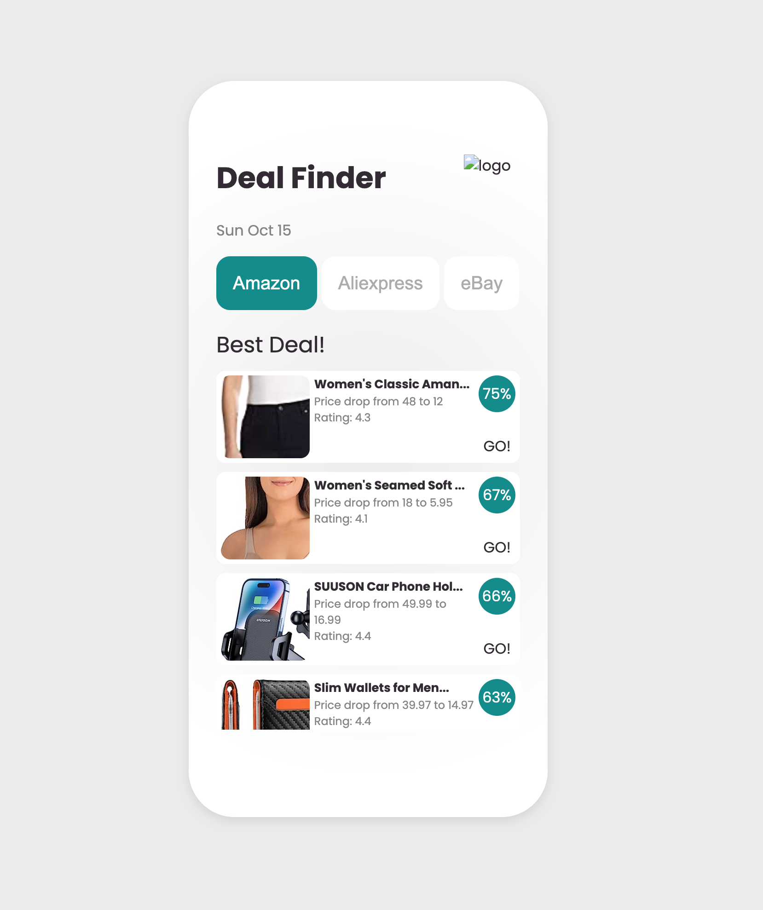

# Web Scraper App using Oxylabs E-Commerce Scraper API

## App using React and Node/Express that scrapes e-commerce websites for the best deals.

This project is a simple e-commerce app that will scrape the best deals currently on amazon using the Oxylabs API and return a sorted list by percentage drop. The app has additional sections currently disabled for Aliexpress, eBay and Etsy for additional features.

    

## Available Scripts

In the project directory, you can run:

### `npm start:frontend`

Runs the app in the development mode.\
Open [http://localhost:3000](http://localhost:3000) to view it in your browser.

The page will reload when you make changes.\
You may also see any lint errors in the console.

### `npm start:backend`

Launches the server.js in browser for editing.\
Open [http://localhost:8000/deals](http://localhost:8000/deals) to view it in your browser and open developer tools to view data in console or you can console.log to the browser in the server.js file to view data in JSON.

The page will reload when you make changes.\
You may also see any lint errors in the console.
